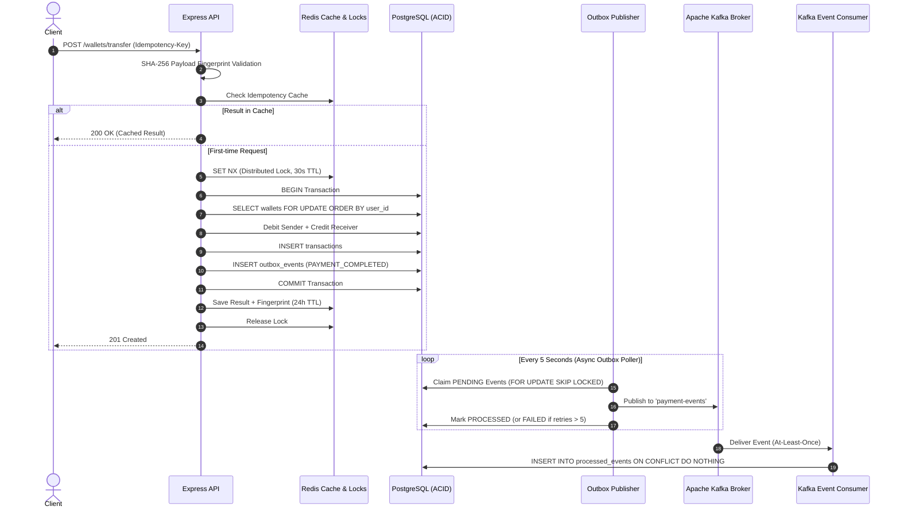

# Distributed Payment and Wallet System

A production-grade, fault-tolerant distributed payment and wallet platform designed for high consistency, zero double-spending, and resilient asynchronous event propagation.

Built with **Node.js, Express, PostgreSQL, Redis, Apache Kafka, and Docker**.

---

## Architecture Overview



---

## Key Distributed Systems & Reliability Features

### 1. Robust Idempotency with SHA-256 Payload Fingerprinting
* **Problem**: Standard idempotency checks only match the key string. An attacker or client bug might reuse an existing idempotency key with different payment details (e.g., changing the receiver or amount), leading to silent accounting errors or cached responses masquerading as completed transfers.
* **Solution**: Every transfer request generates a deterministic SHA-256 hash from `{ sender_user_id, receiver_user_id, amount }`. Both Redis and PostgreSQL checks verify that the payload matches the cached hash. If a key is reused with different details, the API strictly rejects the request with `422 Unprocessable Entity`.

### 2. Deadlock-Free Two-Phase Wallet Locking
* **Problem**: When User A transfers money to User B concurrently with User B transferring money to User A, naive row locking causes database deadlocks (`40P01`).
* **Solution**: All multi-wallet transfers lock both wallet rows simultaneously using:
  ```sql
  SELECT * FROM wallets WHERE user_id IN ($1, $2) ORDER BY user_id FOR UPDATE;
  ```
  Enforcing strict, global ordering (`ORDER BY user_id`) guarantees deterministic lock acquisition and completely prevents deadlocks.

### 3. Transactional Outbox Pattern (Dual-Write Prevention)
* **Problem**: Emitting an event to Kafka directly inside the HTTP request creates a dual-write race condition: if the database commits but Kafka fails, the event is lost; if Kafka succeeds but the database rolls back, downstream systems process phantom money.
* **Solution**: The event is recorded in the PostgreSQL `outbox_events` table inside the *exact same ACID transaction* as the balance updates. An asynchronous worker claims pending events using `FOR UPDATE SKIP LOCKED` and publishes them to Kafka with retry tracking and at-least-once delivery guarantees.

### 4. Dead-Letter Queue & Stale Processing Recovery
* Stalled outbox jobs (`PROCESSING` for > 30 seconds due to worker crashes) are automatically recovered back to `PENDING`.
* If an event fails to publish repeatedly (e.g. malformed data or permanent broker unavailability), its `retry_count` increments. Once it exceeds `MAX_RETRIES` (5), it transitions to `FAILED` with diagnostic error logging, preventing infinite poison-pill loops.

### 5. Consumer-Side Idempotency & Deduplication
* Kafka provides at-least-once delivery semantics.
* The Kafka consumer deduplicates incoming events using unique `outboxEventId` records in `processed_events`:
  ```sql
  INSERT INTO processed_events (event_id, event_type)
  VALUES ($1, $2)
  ON CONFLICT (event_id) DO NOTHING;
  ```
  If an event ID has already been recorded, duplicate deliveries are safely ignored without double-processing.

### 6. Zero-Trust Authentication & Ownership Verification
* Every state-changing wallet operation requires a signed JSON Web Token (JWT).
* Strict ownership guards ensure users can only view, top up, withdraw, and initiate transfers from their own wallet (`HTTP 403 Forbidden` on mismatch).

---

## API Endpoints Reference

| Method | Endpoint | Auth | Description |
|---|---|:---:|---|
| `GET` | `/health` | No | System and database connectivity check |
| `POST` | `/users` | No | Register new user; auto-provisions wallet |
| `POST` | `/login` | No | Authenticate user credentials and return JWT |
| `GET` | `/users/:userId/wallet` | Bearer JWT | View user's wallet balance (owner only) |
| `POST` | `/wallets/:userId/topup` | Bearer JWT | Top up wallet balance with validation |
| `POST` | `/wallets/:userId/withdraw`| Bearer JWT | Withdraw funds with row-level balance checks |
| `POST` | `/wallets/transfer` | Bearer JWT | Idempotent transfer between wallets |
| `GET` | `/users/:userId/transactions` | Bearer JWT | View transaction history |
| `POST` | `/transactions/:transactionId/refund` | Bearer JWT | Refund an existing transfer |

---

## Getting Started

### 1. Prerequisites
* Node.js v18+ (tested on Node v22)
* Docker & Docker Compose
* PostgreSQL 15+
* Redis 7+

### 2. Environment Setup
Copy the example environment file:
```bash
cp .env.example .env
```
Ensure PostgreSQL, Redis, and Kafka credentials match your local setup.

### 3. Spin up Infrastructure with Docker
```bash
docker compose up -d
```
This spins up PostgreSQL, Redis, and Apache Kafka. The database schema from `schema.sql` is automatically mounted.

### 4. Install Dependencies
```bash
npm install
```

### 5. Run the Automated Test Suite
Run the 27 comprehensive unit and integration tests:
```bash
npm test
```

### 6. Start the Server
```bash
npm run dev
# or for production:
npm start
```

---

## Automated Test Coverage

The test suite uses Node.js's native test runner (`node:test` and `node:assert`) without adding third-party testing bloat:

```text
✔ Idempotency Service Unit Tests (4 tests) - PASS
✔ Transactional Outbox Publisher & Dead-Letter Queue Tests (2 tests) - PASS
✔ Payment and Wallet System Integration Tests (21 tests) - PASS
    - User registration and auto wallet provisioning
    - Duplicate registration rejection (HTTP 409)
    - Input validation & password length enforcement
    - JWT authentication & credential verification
    - Route authorization guards (HTTP 401 & 403)
    - Balance consistency & overdraft prevention
    - Idempotency key reuse with identical details (HTTP 200 cached)
    - Idempotency key reuse with modified parameters rejection (HTTP 422)
    - Self-transfer prevention
    - Atomic refunds & refund outbox event generation
    - Double-refund prevention
    - Kafka consumer at-least-once deduplication

Total Tests: 27 | Suites: 9 | Pass: 27 | Fail: 0
```

---

## Technical Interview Talking Points

* **Dual-Write Problem**: Solved via the *Transactional Outbox Pattern*. Never write to database and Kafka in separate unbounded operations.
* **Concurrency & Race Conditions**: Solved via Redis distributed locks for early ingress deduplication, combined with PostgreSQL `SELECT ... FOR UPDATE` row-level locks.
* **Deadlock Prevention**: Always sort lock acquisition order (`ORDER BY user_id`).
* **Idempotency Beyond Keys**: Always hash the request payload. Keys can be reused accidentally or maliciously.
* **Poison Messages**: Mitigated using retry thresholds and dead-letter queues (`FAILED` status after 5 attempts).
